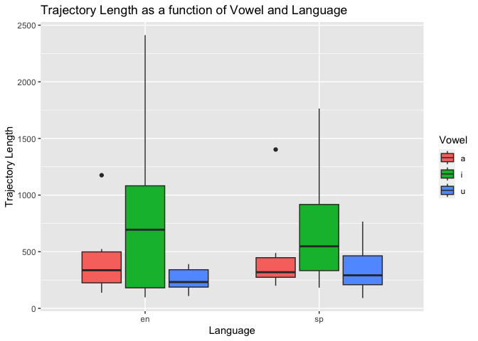
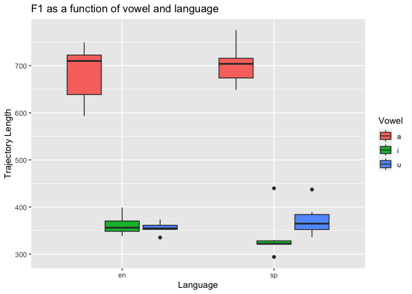
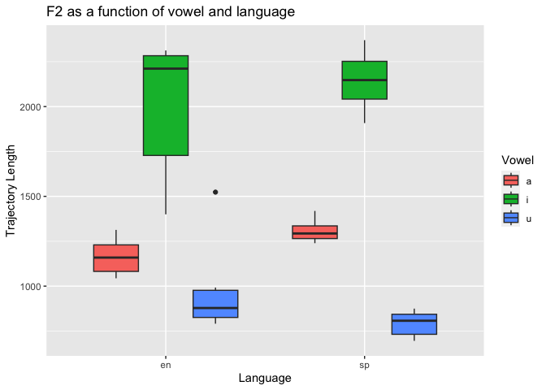

# README.qmd

``` r
library(tidyverse)
```

    ── Attaching core tidyverse packages ──────────────────────── tidyverse 2.0.0 ──
    ✔ dplyr     1.1.4     ✔ readr     2.1.5
    ✔ forcats   1.0.0     ✔ stringr   1.5.1
    ✔ ggplot2   3.4.4     ✔ tibble    3.2.1
    ✔ lubridate 1.9.3     ✔ tidyr     1.3.1
    ✔ purrr     1.0.2     
    ── Conflicts ────────────────────────────────────────── tidyverse_conflicts() ──
    ✖ dplyr::filter() masks stats::filter()
    ✖ dplyr::lag()    masks stats::lag()
    ℹ Use the conflicted package (<http://conflicted.r-lib.org/>) to force all conflicts to become errors

``` r
data <- read.csv("/Users/diegomedina/Desktop/pa_3/data/vowel_data.csv") 
```

7.  Respond to the following questions:

    1.  Examine the portion of the script you see below. In your own
        words what does this section do and why does it work?
        Demonstrate that you understand the code….

        The first sentence establishes the starting point (vonset) of
        the two segments. The second sentence establishes the end point
        of the vector. Line number three calculates the duration of the
        vector by subtracting the results from the starting point from
        the end point.

    2.  In a few short sentences describe the general outline of the
        script, what the purpose is, and how it achieves this purpose
        (hint: focus on the section dividers and the comments).

        This script is aimed to process sound data and output
        information into a CSV file. It sets a loop in order to process
        each interval of the sound data. Within the loop, the script
        asks to read the sound and textgrid files, and calculate
        formants and spectral centroids (the results will be shown in
        the CSV file). The script also delineates sections and give some
        guidance to each block of code.

    3.  In a few short sentences describe how the segmenting procedure
        you used this week differs from that used in `pa_2`. What are
        the advantages and disadvantages?

        In terms of segmenting I did not find any difference,
        nonetheless, instead of getting mid-point values (pa2), in this
        one, we calculated duration at different points in a line (I
        guess it gives more accuracy to the analysis). We also labeled
        items by language.

``` r
glimpse(data)
```

    Rows: 36
    Columns: 17
    $ id       <chr> "yb", "yb", "yb", "yb", "yb", "yb", "yb", "yb", "yb", "yb", "…
    $ item     <chr> "meet", "beat", "feet", "seat", "heat", "fleet", "moss", "bot…
    $ vowel    <chr> "i", "i", "i", "i", "i", "i", "a", "a", "a", "a", "a", "a", "…
    $ language <chr> "en", "en", "en", "en", "en", "en", "en", "en", "en", "en", "…
    $ f1_cent  <dbl> 373.51, 347.28, 338.44, 360.55, 351.57, 398.75, 748.86, 592.9…
    $ f2_cent  <dbl> 1587.15, 2286.70, 2312.45, 2149.90, 2272.86, 1399.89, 1313.27…
    $ tl       <dbl> 2412.52, 97.44, 119.51, 365.82, 1022.86, 1101.87, 424.35, 248…
    $ f1_20    <dbl> 290.50, 356.54, 348.36, 386.73, 328.73, 426.04, 793.57, 575.2…
    $ f1_35    <dbl> 309.66, 355.56, 341.09, 368.98, 361.95, 412.07, 805.20, 585.1…
    $ f1_50    <dbl> 380.55, 349.75, 334.24, 356.01, 358.44, 391.85, 794.82, 590.2…
    $ f1_65    <dbl> 437.33, 340.33, 333.21, 354.14, 355.94, 376.82, 698.66, 602.0…
    $ f1_80    <dbl> 449.53, 334.24, 335.28, 336.88, 352.79, 386.95, 652.03, 612.2…
    $ f2_20    <dbl> 1196.32, 2236.94, 2242.24, 2019.34, 2335.20, 1451.85, 1316.01…
    $ f2_35    <dbl> 1460.58, 2266.43, 2321.60, 2168.97, 2367.99, 1802.80, 1385.54…
    $ f2_50    <dbl> 815.57, 2289.35, 2340.85, 2124.11, 2386.80, 1195.81, 1317.77,…
    $ f2_65    <dbl> 2150.70, 2310.05, 2335.83, 2242.20, 1901.36, 1295.25, 1360.48…
    $ f2_80    <dbl> 2312.59, 2330.72, 2321.72, 2194.90, 2372.94, 1253.73, 1186.55…

``` r
data %>%
  group_by(id) %>%
  summarize(avg_f1_cent = mean(f1_cent),
            sd_f1_cent = sd(f1_cent),
            avg_f2_cent = mean(f2_cent),
            sd_f2_cent = sd(f2_cent),
            avg_tl = mean(tl),
            sd_tl = sd(tl))
```

    # A tibble: 1 × 7
      id    avg_f1_cent sd_f1_cent avg_f2_cent sd_f2_cent avg_tl sd_tl
      <chr>       <dbl>      <dbl>       <dbl>      <dbl>  <dbl> <dbl>
    1 yb           469.       166.       1398.       550.   523.  514.

``` r
print(data) 
```

       id    item vowel language f1_cent f2_cent      tl  f1_20  f1_35  f1_50
    1  yb    meet     i       en  373.51 1587.15 2412.52 290.50 309.66 380.55
    2  yb    beat     i       en  347.28 2286.70   97.44 356.54 355.56 349.75
    3  yb    feet     i       en  338.44 2312.45  119.51 348.36 341.09 334.24
    4  yb    seat     i       en  360.55 2149.90  365.82 386.73 368.98 356.01
    5  yb    heat     i       en  351.57 2272.86 1022.86 328.73 361.95 358.44
    6  yb   fleet     i       en  398.75 1399.89 1101.87 426.04 412.07 391.85
    7  yb    moss     a       en  748.86 1313.27  424.35 793.57 805.20 794.82
    8  yb     bot     a       en  592.98 1068.26  248.73 575.27 585.15 590.22
    9  yb  fought     a       en  615.64 1123.36 1175.58 631.89 618.75 661.00
    10 yb  sought     a       en  707.54 1194.75  138.18 667.91 698.76 719.37
    11 yb  caught     a       en  725.83 1241.43  217.42 765.01 759.05 714.61
    12 yb brought     a       en  712.28 1043.76  523.54 676.92 680.12 724.21
    13 yb    moot     u       en  363.44  790.76  390.81 430.21 384.99 348.73
    14 yb    boot     u       en  335.19  825.99  363.64 364.54 332.56 326.08
    15 yb    food     u       en  354.57  825.57  186.53 363.71 360.55 359.79
    16 yb  soothe     u       en  351.70 1523.59  191.34 365.18 351.94 340.02
    17 yb   cooed     u       en  354.51  930.34  108.92 359.99 353.51 353.78
    18 yb    dude     u       en  373.45  992.13  273.17 372.59 369.94 373.26
    19 yb     mis     i       sp  439.68 2369.93  326.59 460.90 463.80 459.90
    20 yb     bis     i       sp  293.97 2040.53  742.84 305.63 293.78 289.46
    21 yb     pis     i       sp  321.52 1908.11 1763.93 308.65 332.94 327.34
    22 yb    cito     i       sp  322.46 2045.06  975.25 344.18 320.61 311.80
    23 yb    fito     i       sp  329.97 2249.90  352.57 341.26 348.02 315.92
    24 yb   quito     i       sp  321.02 2252.63  182.94 339.70 316.32 320.14
    25 yb     mas     a       sp  710.75 1418.69  324.56 729.88 707.33 813.49
    26 yb     vas     a       sp  666.12 1317.28  199.72 627.64 679.56 707.23
    27 yb    pasa     a       sp  717.27 1263.55  314.06 641.10 717.25 740.92
    28 yb    sala     a       sp  696.92 1269.33 1402.39 710.34 702.91 718.89
    29 yb    fama     a       sp  775.08 1239.24  261.11 806.67 821.38 803.33
    30 yb    cama     a       sp  648.66 1341.65  488.34 604.39 635.52 651.47
    31 yb    musa     u       sp  437.10  819.49  766.11 544.57 346.94 396.14
    32 yb   bulto     u       sp  336.43  851.24  515.24 367.96 337.47 336.18
    33 yb    puso     u       sp  349.01  795.07  309.72 367.42 353.10 347.93
    34 yb    supo     u       sp  361.33  874.81  187.06 380.44 370.95 362.07
    35 yb    fumo     u       sp  389.19  710.64   91.15 377.07 380.65 385.89
    36 yb    cura     u       sp  368.02  695.26  273.69 359.37 359.36 365.06
        f1_65  f1_80   f2_20   f2_35   f2_50   f2_65   f2_80
    1  437.33 449.53 1196.32 1460.58  815.57 2150.70 2312.59
    2  340.33 334.24 2236.94 2266.43 2289.35 2310.05 2330.72
    3  333.21 335.28 2242.24 2321.60 2340.85 2335.83 2321.72
    4  354.14 336.88 2019.34 2168.97 2124.11 2242.20 2194.90
    5  355.94 352.79 2335.20 2367.99 2386.80 1901.36 2372.94
    6  376.82 386.95 1451.85 1802.80 1195.81 1295.25 1253.73
    7  698.66 652.03 1316.01 1385.54 1317.77 1360.48 1186.55
    8  602.06 612.22 1048.18 1025.46  995.61 1084.01 1188.01
    9  558.87 607.69 1236.91 1332.38 1306.62  676.35 1064.53
    10 740.01 711.66 1243.37 1190.28 1175.75 1176.02 1188.33
    11 685.69 704.77 1156.65 1204.15 1238.74 1269.66 1337.93
    12 760.35 719.80  936.91 1039.55 1207.30 1061.92  973.14
    13 329.22 324.07  782.28  710.64  691.27  814.99  954.63
    14 323.54 329.24  750.33  706.78  807.74  849.10 1016.01
    15 337.56 351.24  760.43  767.92  808.29  851.35  939.87
    16 335.08 366.29 1557.75 1470.25 1507.23 1524.31 1558.41
    17 347.66 357.64  949.35  938.70  902.29  904.37  957.01
    18 376.59 374.86 1107.04 1001.95  940.56  915.11  995.99
    19 427.51 386.28 2452.96 2359.62 2424.32 2338.94 2273.83
    20 284.05 296.91 2234.26 2290.59 2307.41 1729.93 1640.44
    21 316.67 322.00  725.58 2274.58 2261.75 2216.30 2062.33
    22 289.32 346.42 2259.19 2320.96 2313.51 1911.78 1419.85
    23 327.97 316.69 2319.64 2313.63 2313.46 2296.65 2006.12
    24 323.19 305.78 2271.72 2280.95 2299.06 2249.87 2161.56
    25 647.25 655.79 1367.68 1371.66 1438.32 1456.33 1459.47
    26 682.49 633.65 1351.93 1325.02 1325.76 1328.82 1254.88
    27 787.51 699.55 1170.61 1210.93 1297.85 1313.07 1325.29
    28 697.18 655.28 1407.94  817.08 1173.61 1522.29 1425.74
    29 753.40 690.60 1257.58 1256.17 1296.80 1252.73 1132.90
    30 717.64 634.29 1487.04 1424.42 1384.73 1350.78 1061.28
    31 421.12 476.75 1242.53  805.20  746.72  739.00  564.00
    32 326.81 313.73  725.68  674.37  787.82  939.14 1129.18
    33 343.45 333.14  715.50  732.45  741.63  767.72 1018.04
    34 351.91 341.26  983.61  908.42  851.83  828.18  802.01
    35 388.03 414.32  732.21  729.94  727.08  712.20  651.77
    36 365.87 390.46  627.73  591.84  677.56  753.84  825.35

``` r
data %>%
  ggplot(
    aes(x = language, y = tl, fill = vowel)) +
  geom_boxplot() +
  labs(x = "Language", y = "Trajectory Length", fill = "Vowel") +
ggtitle("Trajectory Length as a function of Vowel and Language")
```



``` r
data %>%
  ggplot(
    aes(x = language, y = f1_cent, fill = vowel)) +
  geom_boxplot() +
  labs(x = "Language", y = "Trajectory Length", fill = "Vowel") +
ggtitle("F1 as a function of vowel and language")
```



``` r
data %>%
  ggplot(
    aes(x = language, y = f2_cent, fill = vowel)) +
  geom_boxplot() +
  labs(x = "Language", y = "Trajectory Length", fill = "Vowel") +
ggtitle("F2 as a function of vowel and language")
```


